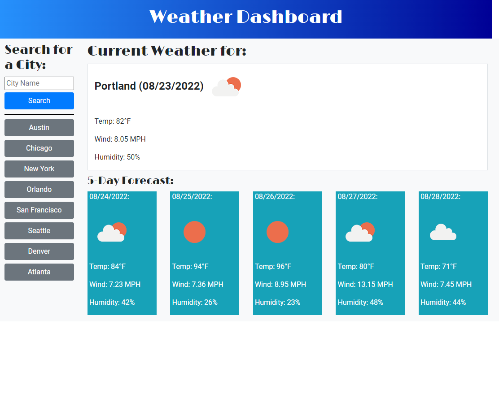

# Weather Dashboard App

## About This Project

This is a weather dashboard where you can enter the name of the city in the search field. When you click 'submit' the current and 5-day forecast of temperature, wind speed, humidity, and an icon for that city  will populate the areas on the right. Cities previously searched are saved to localStorage and buttons of those cities are created to provide quick access to those weather forecasts.

(<a href="#top">back to top</a>)

## Built With

* HTML
* CSS
* JavaScript
* Moment.js
* Google Fonts
* JQuery
* Bootstrap

## Website URL

https://apatheticjedi.github.io/weather-dashboard-app/

##

Created by David Lundt

(<a href="#top">back to top</a>)
